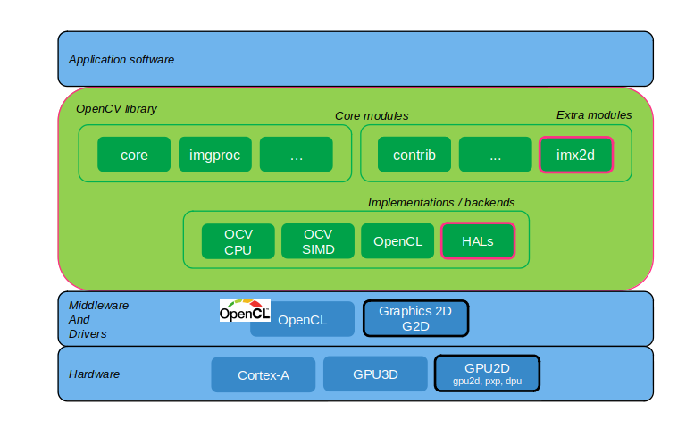

# Overview


## Presentation

Purpose of this module is to accelerate execution of OpenCV functions by using i.MX 2D acceleration hardware and frameworks.

Current version supports hardware acceleration of the primitives:
- Image scaling: `cv::resize()`
- Horizontal/vertical flip: `cv::flip()`
- Multiple of 90 degrees rotation: `cv::rotate()`

Future versions will add acceleration support for:
- Color Space Conversion: `cv::cvtColor()` / `cv::cvtColorTwoPlane()`
- Generic geometrical transformation: `cv::remap()`
- Affine transformation to an image: `cv:warpAffine()`
- ...

Platforms supported are:
- i.MX 8M Plus (GPU2D)
- i.MX 93 (PXP)
- i.MX 8QuadMax (DPU)
- i.MX 8QuadXPlus (DPU)


## Architecture



From OpenCV point of view, the component consists in two parts:
1. A Hardware Adaptation Layer (HAL) library implementing the accelerated version of the overriden functions.

2. The imx2d extra module that provides the implementation for:
    * Dedicated interfaces exposed to the user applications
    * Mat buffer allocator using graphic buffers
    * Some utility classes shared with the HAL

Present version makes uses of 2D graphic accelerator, that can be GPU2D, PXP or DPU depending on the i.MX platform. Future releases will introduce support for other acceleration devices like ISI.


## Memory management

OpenCV common container for images is a `Mat` (matrix) object implemented by the [`cv::Mat`](https://docs.opencv.org/4.x/d3/d63/classcv_1_1Mat.html) class. It consists in a reference to a buffer and a number of attributes defining the properties of the embedded data such as its data type, dimensions, number of channels etc.


### System memory buffers

Using OpenCV standard implementation, `Mat` buffers are allocated from:
- System memory (`malloc`) when instantiated from C++ API
- Numpy buffer, backed by system memory, when instantiated from Python bindings
In both cases, buffer consists in user space virtual memory that is mapped to CPU through MMU, that is not continuous in physical memory.
Such buffers are later referenced as System memory buffers, short-named as 'Si' for 'system input buffer', and 'So' for 'system output buffer'.


### Graphic buffers

Hardware accelerators require usage of continuous memory accessed by devices through DMA physical bus address. Such buffers are later referenced as Graphic memory buffers, short-named as 'Gi' for 'graphic input buffer', and 'Go' for 'graphic output buffer'.
Several options are possible to process `Mat` buffers from hardware accelerators, as listed in following sections. The option used depends on different factors:
- Custom `Mat` graphic allocator enablement by user application
- Underlying hardware accelerator support for 3 channels operations


### Mat buffers backed by system memory

In the case where `Mat` in use are holding buffers allocated from system memory, they can not be accessed directly by the acceleration device. Intermediate buffer copies are needed to push the data to the device, and copy back the device processing result to the application buffer.


Sequence of actions is as follow:
1. User application submits `Mat` objects with respective input (Si) and output (So) buffers backed in system memory
2. Temporary graphic buffers preprocessing:
    * Graphic input (Gi) and output (Go) buffers allocation
    * System input (Si) buffer copy to temporary graphic input (Gi) buffer
3. Graphic input buffer cache clean to update physical memory with the CPU view of the input buffer
4. Execute accelerated 2D operation referencing the graphic buffers
5. Graphic output buffer cache is invalidated so that CPU can read-access the buffer after device update
6. Final steps:
    * Copy result to application system output (So) buffers
    * Intermediate graphic buffers are freed


### Mat buffers backed by graphic memory

Application has the option to enable the custom Mat graphic allocator. Doing so, `Mat` buffers will be allocated from a graphic memory pool instead of the system memory.
Option is not available from Python bindings where `Mat` containers have to be backed by Numpy buffers.
Benefit of this approach is to save the cost of the intermediate graphic buffers allocation and copy.


Sequence of actions is as follow:
1. User application submits `Mat` objects with respective input (Gi) and output (Go) buffers backed in graphic memory
2. Graphic input buffer cache clean
3. Execute accelerated 2D operation referencing the graphic buffers
4. Graphic output buffer cache is invalidated


### 3 channels emulation

DPU accelerator supports both 3 and 4 channels formats.
GPU2D and PXP accelerators support 4 channels operations like BGRA but not 3 channels such as BGR that is the default OpenCV color format.

For platforms where only 4 channels operations are supported, operation on `Mat` containers holding 3 channels image may still be accelerated by adding extra conversion steps:
- 3 channels input buffer is converted to a 4 channels input buffer before executing the accelerated 2D operation
- resulting 4 channels output buffer is converted back to a 3 channels buffers passed to the application

Such buffer color format conversions are done using OpenCV primitives that are:
1. Neon accelerated
2. multi-threaded

Such emulated support is beneficial at the condition that the extra load associated to format conversion remains small compared to the processing time of the 2D operation when executed on CPU.
In that case the conversion overhead on the CPU for the color conversion is compensated by the gain of delegating the execution of the 2D operation to the hardware accelerator.

For this reason, this is used only for `cv::resize()` acceleration.

In such case where color format conversion is required before/after the accelerated 2D operation, it does not matter if input and output `Mat` containers are based on system or graphic memory buffers. Color format converted images will consistently be stored in graphics buffers so that they are accessible to the accelerator device.


Sequence of actions is very similar to the one described for [buffers in system memory sequence](#mat-buffers-backed-by-system-memory), with a few specificities:
- input and output buffers may be either system or graphic memory
- copy from/to intermediate graphic buffers is replaced by Color Space Conversion that implies buffer copy


# Module interfaces

Interfaces exported by `imx2d` module are listed in its [public header file](./include/opencv2/imx2d.hpp).
All definitions from the public API belong to the `cv::imx2d::` namespace. Associated Python bindings, when available, belong to `cv2.imx2d` sub-package.

Following sections give an overview of the functions provided.


## 2D acceleration activation and status

By default module is disabled so functions will not be accelerated.
Interface is provided to enable activation of the module and to query its status.

| C++ definition                | Python binding | Description                        |
| ------------------------------|----------------|------------------------------------|
| `void setUseImx2d(bool)`      | y | Enable/disable acceleration module |
| `bool useImx2d()`             | y | Get activation status              |


### Usage

C++
```C++
#include <iostream>
#include "opencv2/imx2d.hpp"
using namespace cv;

imx2d::setUseImx2d(true);
std::cout << "useImx2d: " <<  imx2d::useImx2d() << std::endl;
```

Python
```Python
from cv2 import imx2d

imx2d.setUseImx2d(True)
print(imx2d.useImx2d())
```

## Graphic memory Mat allocator

Memory management considerations are presented [here](#memory-management).


### allocator activation

Standard `Mat` container uses memory buffers allocated from system memory, inducing overhead of buffer copies to graphic buffers.

Module implements a graphic memory `Mat` allocator, disabled by default, that uses graphic memory allocation for memory buffers, instead of system memory.

An interface is provided to enable activation of this custom `MatAllocator`, and to query its status.

| C++ definition                        | Python binding | Description                |
| --------------------------------------|----------------|----------------------------|
| `void setUseGMatAllocator(bool)`      | n | Enable/disable graphic memory `MatAllocator` |
| `bool useGMatAllocator()`             | n | Get activation status                        |


### Allocator configuration

A couple of parameters of the graphic memory `Mat` allocator can be configured from user application.

1. Minimum `Mat` buffer size to be allocated as a graphic buffer. It may be used by applications that use many smaller `Mat` containers holding non-graphic data
2. Graphic buffer CPU cache configuration, cached or uncached. Cached buffers have the downside of requiring coherency maintenance operations (flush, invalidate) but have much faster CPU access

Interface is provided to configure above parameters to be used by the graphic memory `MatAllocator`.

| C++ definition                        | Python binding | Description                |
| --------------------------------------|----------------|----------------------------|
| `class GMatAllocatorParams(<constructor signature>)`       | n | Graphic `Mat` allocator configuration parameters |
| `void setGMatAllocatorParams(const GMatAllocatorParams &)` | n | Configure graphic memory `MatAllocator` parameters |

Default `MatAllocator` configuration applied can be reviewed from `GMatAllocatorParams` declaration in the [public header file](./include/opencv2/imx2d.hpp).

Note: Graphic `Mat` Allocator is to be configured before being enabled.

### Usage

C++
```C++
#include "opencv2/imx2d.hpp"
using namespace cv;

// change default allocator configuration before its activation
imx2d::setGMatAllocatorParams(imx2d::GMatAllocatorParams(42 /* sizeMin */, true /* cacheable */));
imx2d::setUseGMatAllocator(true);
```

## Graphic memory pool configuration

Graphic buffers are allocated by the `imx2d` module for:
1. `Mat` buffer allocation when [graphic memory allocator](#graphic-memory-mat-allocator) is enabled
2. Allocation of intermediate graphic buffer when needed by memory use cases [Mat buffers in system memory](#mat-buffers-backed-by-system-memory) and [3 channels emulation](#3-channels-emulation)


Allocation of a new graphic buffer takes some time. Moreover, some graphic buffers may have to be frequently allocated and deallocated, like for instance the intermediate buffers from the use case [Mat buffers in system memory](#mat-buffers-backed-by-system-memory).

Based on the assumption that graphic buffers of the same size are likely to be deallocated and reallocated multiple times by a given application, a cache of recently deallocated graphic buffers is implemented.
Its principle is simply to not free graphic buffers immediately after being deallocated by application or core, but to keep a number of recently used buffers available for fast reallocation.

To prevent this deallocated buffers cache from growing indefinitely, a couple of configurable parameters are defined to restrict the numbers of buffers held in that cache. In case a new released buffer would exceed those cache limits, oldest cached buffers would be immediately freed to make enough room to fit the more recent buffer.

Graphic memory buffers cache parameters exposed to the user application are:
1. Maximum total number of bytes held in the cache, accumulating every buffer size
2. Number of buffers in the cache

Deallocated buffers cache is enabled by default.
Interface is provided to configure its parameters.


| C++ definition                        | Python binding | Description                |
| --------------------------------------|----------------|----------------------------|
| `class BufferCacheParams(<constructor signature>)`    | y | Graphic memory pool configuration parameters |
| `void setBufferCacheParams(const BufferCacheParams&)` | y | Configure deallocated buffers cache parameters |

Default deallocated buffers cache configuration applied can be reviewed from `BufferCacheParams` declaration in the [public header file](./include/opencv2/imx2d.hpp).


### Usage

C++
```C++
#include "opencv2/imx2d.hpp"
using namespace cv;

BufferCacheParams params(16 * 1024 * 1024  /* cacheUsageMax */,
                         42 /* cacheAllocCountMax */);
imx2d::setBufferCacheParams(params);
```


Python
```Python
from cv2 import imx2d

params = imx2d.BufferCacheParams(16*1024*1024, 42)
imx2d.setBufferCacheParams(params)
```


# Accelerated primitives

Primitives can be accelerated when `Mat` container data type is compatible with acceleration hardware capabilities.

If acceleration is not possible, implementation falls back onto alternative OpenCV implementation, that may be provided by [Carotene HAL](https://github.com/opencv/opencv/tree/4.x/3rdparty/carotene) with NEON optimization or to the default OpenCV CPU implementation.


## cv::resize()

Conditions for 2D accelerated execution:

| Parameter    | Value(s)         |
|--------------|---------------|
| `Mat` [`depth()`](https://docs.opencv.org/4.x/d3/d63/classcv_1_1Mat.html#a8da9f853b6f3a29d738572fd1ffc44c0) | `CV_8U` |
| `Mat` [`channels()`](https://docs.opencv.org/4.x/d3/d63/classcv_1_1Mat.html#aa11336b9ac538e0475d840657ce164be) | [`3`(*), `4`] |
| `resize()` [`interpolation`](https://docs.opencv.org/4.x/da/d54/group__imgproc__transform.html#ga5bb5a1fea74ea38e1a5445ca803ff121) | `INTER_LINEAR` |

(*) supported on platforms with DPU. Other platforms use [3 channels emulation](#3-channels-emulation).


## cv::flip() / cv::rotate()

Conditions for 2D accelerated execution:

| Parameter    | Value(s)         |
|--------------|---------------|
| `Mat` [`depth()`](https://docs.opencv.org/4.x/d3/d63/classcv_1_1Mat.html#a8da9f853b6f3a29d738572fd1ffc44c0) | `CV_8U` |
| `Mat` [`channels()`](https://docs.opencv.org/4.x/d3/d63/classcv_1_1Mat.html#aa11336b9ac538e0475d840657ce164be) | [`3`(*), `4`] |
| `Mat` [`ptr()`](https://docs.opencv.org/3.4/d3/d63/classcv_1_1Mat.html#a13acd320291229615ef15f96ff1ff738) | different source and destination buffer: in-place operation not supported |

(*) supported on platforms with DPU.


# Sample application

A cpp sample application exercising the module on a [`VideoCapture`](https://docs.opencv.org/4.x/d8/dfe/classcv_1_1VideoCapture.html) input stream is provided [here](./samples/camera_resize.cpp). It demonstrates combination of resize, flip and rotate, with i.MX2D acceleration and/or graphic `Mat` allocator enabled.

This application uses `highgui` OpenCV module that relies on `Qt` framework. Therefore, in order to have a functional GUI, application must be built with a SDK including the `Qt` packages.

Installation path of the application is typically `/usr/bin/imx2d` when built and installed with [build.sh](../build.sh) script. Thus, for convenience shell `PATH` variable can be adjusted accordingly:

```bash
$ PATH="/usr/bin/imx2d:${PATH}"
```
Input and output video and execution options can be configured via command line.
Available options are listed with the help command argument.
```bash
$ example_imx2d_video_test --help
```
Usage example to capture a QVGA stream from `/dev/video5` device using `V4L2` backend, with video output resized to VGA after 90 degrees rotation:
```bash
$ example_imx2d_video_test --cv4l2 --cid=5 --iw=320 --ih=240 --ow=640 --oh=480 --rotate=1
```
Usage example to capture a VGA `videotest` stream from [`gst-launch`](https://gstreamer.freedesktop.org/documentation/tools/gst-launch.html?gi-language=c) pipeline using `GStreamer` backend, and output the video after vertical flip:
```bash
$ example_imx2d_video_test --cgst --cstr="videotestsrc ! videoconvert ! appsink" --flip=2
```
Usage example to capture a VGA video stream from `/dev/video0` camera, apply a 180 degrees rotation and display resulting output, having i.MX 2D acceleration enabled but disabling the graphic `Mat` allocator:
```bash
$ example_imx2d_video_test --cid=0 --imx2d=1 --alloc=0 --rotate=2
```

# Tests

## Functional tests

Functional tests are run executing the command:

```bash
$ opencv_test_imx2d
```

## Performance tests

Performance tests verify for multiple use cases (channels, resolution, memory backing buffers...) the output of a 2D operation and also compare the execution time with different backend: 2D accelerated, CPU, OpenCL (when available).

These tests are run executing the command:

```bash
$ opencv_perf_imx2d
```

